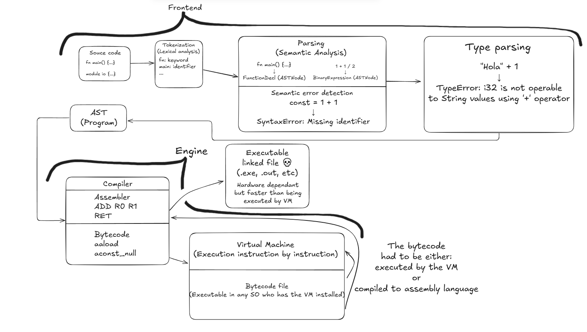

# Scraplang

## :warning: Considerations :warning:

- A more detailed README will be finished when somehow the source code can be runned
- By the way, this README will only contain a proyect structure explanation and a basic CLI use guide (obviously, all is provisional)
- At the moment, this project is obviously incompleted, and still is a experimental not responsible project

## Language layers

The following image shows a provisional architecture of the project of how the source code is treated until it's executed



## Provisional CLI use

### Running the program

```bash
scrap run main.scrap
```

#### Run a portable bytecode file

```bash
scrap run main.byte
```

> For more info about what it's a '.byte' file, reads: [Compile to portable bytecode](#compile-to-portable-bytecode)

### Compiling the program

#### Compile to portable bytecode

```bash
scrap build --type byte main.scrap
```

#### Compile to assembly code

```bash
scrap build --type asm main.scrap
```

#### Compile to hardware dependant machine code

```bash
scrap build --type bin main.scrap
```

### Specify a name to the output file

```bash
scrap build --type ... --output myfile main.scrap
```

### Compiling from different files

Since ScrapLang is capable to compile to assembly language directly from the generated AST and from generated bytecode or to binary from an assembly language file, u can also pass files of these types to the ScrapLang CLI and will automatically detect to what need to compile from the input file.

#### Compile from bytecode to assembly language

```bash
scrap build --type asm main.byte
```

#### Compile from bytecode to an executable file (binary)

```bash
scrap build --type bin main.byte
```

#### Compile from assembly language to an executable file (binary)

```bash
scrap build --type bin main.asm
```

#### Compile mixing [different file format](#compiling-from-different-files)

```bash
scrap build --type bin main.scrap server.asm
```

### Implicit rules

#### Compilation type

By default, if u doesn't provide a value for 'type' parameter (--type ...),
the ScrapLang CLI will implicitly asume that the desired file will be a binary executable file, **whatever it is** the format of the input file.

> This implicit rule rule also applies for [any other file formats](#compiling-from-different-files) supported by ScrapLang

```bash
# From a .scrap file
scrap build main.scrap

# From a bytecode file
scrap build main.byte
```
